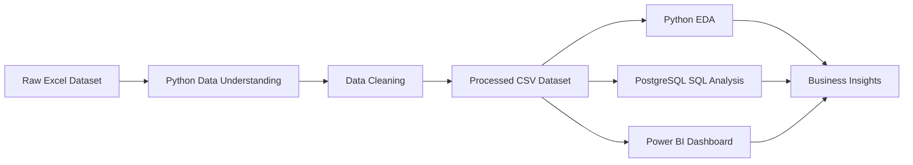

# Banking Portfolio and Risk Analytics

An end-to-end data analytics project that examines banking client portfolios, lending exposure, deposits, risk scores, customer segments, and product engagement using Python, PostgreSQL, and Power BI.

## Business Problem

Banks need a clear view of customer portfolios, lending exposure, deposit balances, customer segments, and risk-review priorities. This project transforms a raw banking Excel dataset into a structured analytics workflow and interactive Power BI dashboard.

## Objectives

- Understand and clean the banking customer dataset.
- Analyze customer demographics, loyalty, relationships, income, and product engagement.
- Measure loan amounts, deposits, account balances, and lending exposure.
- Analyze Risk Score distribution and Score 4–5 review records.
- Build SQL queries for banking portfolio analysis.
- Create an interactive Power BI dashboard.
- Deliver data-backed insights and practical recommendations.

## Dataset

The project uses a banking client portfolio dataset with 3,000 records and 25 original columns.

Key fields include:

- Customer profile: Age, Gender, Nationality, Occupation
- Banking profile: Banking Relationship, Loyalty Classification, Fee Structure
- Financial profile: Estimated Income, Loan Amount, Deposit Amount, Account Balances
- Product profile: Credit Card Count, Business Lending, Property Count
- Risk profile: Risk Score
- Time profile: Joined Date

> **Privacy note:** Raw and processed datasets are excluded from this repository because they may contain customer-identifiable and financial information.

## Tools and Technologies

- Microsoft Excel
- Python
- Pandas and NumPy
- Matplotlib and Seaborn
- PostgreSQL and pgAdmin
- SQL
- Power BI
- Git and GitHub
- VS Code

## Project Architecture



## Data Cleaning

The data-cleaning process includes:

- Column-name standardization
- Data-type correction
- Missing-value checks
- Exact duplicate-row checks
- Duplicate source Customer ID investigation
- Logical validation for age, risk score, and financial values
- Outlier investigation without automatic deletion
- Creation of a unique `client_record_id` surrogate key

## Data Transformation

Derived columns created for analysis include:

- Age Group
- Customer Tenure Years
- Income Segment
- Loan Amount Segment
- Risk Score Band
- Loan-to-Income Ratio
- Loan-to-Income Band
- Total Account Balance
- Total Lending Exposure
- Active Product Category Count

## SQL Analysis

The PostgreSQL analysis includes:

- Executive portfolio KPIs
- Customer analysis by gender and age group
- Risk Score distribution
- Banking relationship exposure analysis
- Loyalty and deposit analysis
- Income-segment analysis
- Score 4–5 risk-review records
- Investment-advisor lending exposure
- Customer onboarding trend

## Power BI Dashboard

The Power BI dashboard contains four pages:

1. **Executive Summary** — Portfolio KPIs, onboarding trend, relationship exposure, and risk-score distribution.
2. **Customer Analysis** — Demographics, income segments, loyalty, and product engagement.
3. **Risk Analysis** — Risk Score analysis, lending exposure, loan-to-income ratio, and Score 4–5 review table.
4. **Insights Dashboard** — Advisor exposure, loyalty deposits, findings, and recommendations.

## Key KPIs

| KPI | Baseline Value |
|---|---:|
| Client Records | 3,000 |
| Unique Source Customer IDs | 2,940 |
| Total Loan Amount | 1,774,158,465.76 |
| Total Deposit Amount | 2,014,680,581.53 |
| Total Lending Exposure | 4,383,966,510.63 |
| Average Estimated Income | 171,305.03 |
| Average Risk Score | 2.25 |
| Score 4–5 Risk Review Records | 482 |
| Score 4–5 Risk Review Percentage | 16.07% |

## Key Insights

- Retail has the largest lending exposure: 2,093,100,933.31 across 1,436 client records.
- Score 4–5 records account for 16.07% of client records and have 1,045,156,041.99 in total lending exposure.
- Jade is the largest loyalty segment by total deposits: 927,143,774.78.
- Eugene Cunningham manages the largest lending-exposure portfolio among available advisors: 241,587,665.81.

## Important Limitations

- `Customer ID` is not fully unique and is not used as the primary key.
- The Risk Score direction is not documented; Score 4–5 records are used for review prioritisation, not confirmed default risk.
- Default status, repayment history, EMI, credit score, loan status, and transaction data are not available.
- Location ID cannot support accurate city-level analysis without a location master.
- The monetary unit is not documented.

## Recommendations

- Confirm and document the business meaning of Risk Score.
- Prioritise Score 4–5 records for portfolio review.
- Monitor lending concentration in the Retail relationship.
- Review advisor-level lending exposure alongside approved risk policies.
- Add default, payment, EMI, credit-score, loan-status, and city-master data for stronger risk analysis.

## Project Structure

```text
Banking-Data-Analytics/
├── data/
│   ├── raw/                 # Excluded from GitHub for privacy
│   ├── processed/           # Excluded from GitHub for privacy
│   └── README.md
├── docs/
├── notebooks/
├── powerbi/
├── python/
│   ├── 01_data_understanding.py
│   ├── 02_data_cleaning.py
│   ├── 03_data_transformation.py
│   ├── 04_eda.py
│   └── outputs/
├── sql/
│   ├── 01_create_database.sql
│   ├── 02_create_table.sql
│   ├── 03_data_quality_queries.sql
│   └── 04_banking_analytics_queries.sql
├── .gitignore
├── README.md
└── requirements.txt
```

## How to Run

1. Clone the repository.

```bash
git clone https://github.com/YOUR_USERNAME/banking-portfolio-risk-analytics.git
cd banking-portfolio-risk-analytics
```

2. Create and activate a virtual environment.

```powershell
python -m venv .venv
.\.venv\Scripts\Activate.ps1
```

3. Install dependencies.

```powershell
pip install -r requirements.txt
```

4. Place your Excel dataset in:

```text
data/raw/banking_data.xlsx
```

5. Run the Python scripts in order.

```powershell
python python/01_data_understanding.py
python python/02_data_cleaning.py
python python/03_data_transformation.py
python python/04_eda.py
```

6. Import `data/processed/transformed_banking_clients.csv` into PostgreSQL and Power BI.

## Future Scope

- Add default and repayment data.
- Add credit score and EMI fields.
- Add city and region mapping.
- Add transaction-level trends.
- Implement scheduled Power BI refresh from a governed source.
- Build confirmed low-, medium-, and high-risk segments after Risk Score rules are documented.

## Author

my name   
swapnil dattarao taur
B.Sc. Artificial Intelligence & Machine Learning Student