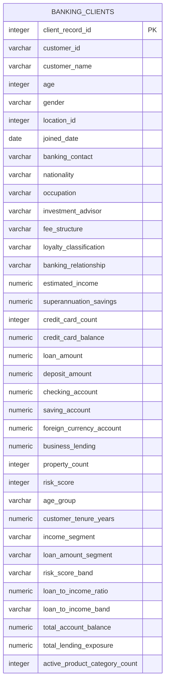

# Banking Portfolio and Risk Analytics — Data Model

## Model Decision

The source dataset is a single customer-level banking portfolio dataset. It does not provide separate reliable tables for customers, loans, payments, cities, or transactions.

Therefore, the project uses a single analytical table named `banking_clients`.

## Main Table

**Table name:** `banking_clients`  
**Grain:** One client-portfolio record per `client_record_id`  
**Primary key:** `client_record_id`



## Key Design Rules

| Key | Column | Reason |
|---|---|---|
| Primary Key | `client_record_id` | Unique identifier created during data cleaning for every record. |
| Business Identifier | `customer_id` | Original source identifier. It is not unique, so it cannot be used as a primary key. |
| Date Field | `joined_date` | Used for customer onboarding and tenure analysis. |
| Risk Field | `risk_score` | Original score from 1 to 5. |
| Derived Risk Field | `risk_score_band` | Groups scores without assuming low/high-risk business meaning. |

## Measure Groups

| Group | Columns |
|---|---|
| Customer Profile | age, gender, nationality, occupation, banking_relationship, loyalty_classification |
| Income and Wealth | estimated_income, superannuation_savings, property_count |
| Lending Exposure | loan_amount, business_lending, credit_card_balance, total_lending_exposure |
| Account Balances | deposit_amount, checking_account, saving_account, foreign_currency_account, total_account_balance |
| Risk | risk_score, risk_score_band, loan_to_income_ratio, loan_to_income_band |
| Product Engagement | credit_card_count, active_product_category_count |
| Time | joined_date, customer_tenure_years |

## Relationship and Cardinality

No physical relationship is created in PostgreSQL because only one valid source table exists.

In Power BI, a future `Dim_Date` table can have a one-to-many relationship:

```text
Dim_Date[Date] (One) → banking_clients[joined_date] (Many)
```

This relationship supports year, quarter, and month-based customer onboarding analysis.

## Why a Star Schema Is Not Used Now

A star schema requires stable dimension tables and reliable keys. The source data does not provide:

- A unique, reliable customer dimension key
- Separate loan-level records or loan IDs
- City/location master data
- Payment or transaction records
- Default status records

Creating separate dimensions from this source would duplicate values without adding analytical reliability. A clean single-table analytical model is therefore the correct and explainable design.
